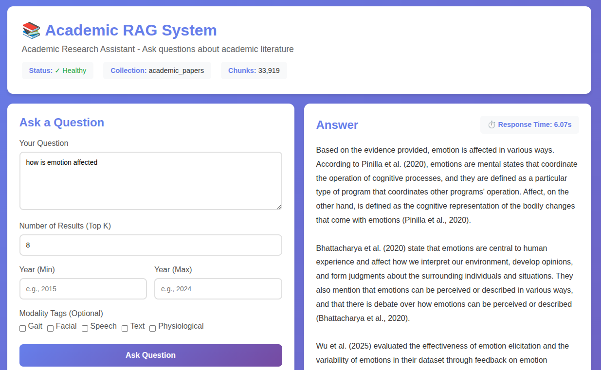

# Academic RAG System



A minimal, controlled RAG (Retrieval-Augmented Generation) system for academic literature review. Built with explicit control over every component: chunking, retrieval, prompt construction, and citation formatting.

## Overview

This is **not** a generic, off-the-shelf RAG. It's a domain-specific system designed for:
- **Academic rigor**: Enforces proper citation style (Author, Year)
- **Transparency**: Full control over chunking, retrieval, and prompting
- **Auditability**: Track which papers contribute to each answer
- **Domain awareness**: Metadata filtering by year, modality tags, etc.
- **Flexible LLM support**: Choose between OpenAI API or self-hosted vLLM
- **Web UI**: Modern interface for querying without curl commands

### LLM Options

- **OpenAI API** - GPT-4, GPT-3.5-turbo, or Azure OpenAI
- **vLLM** - Self-hosted models (Mistral, Llama-2, Mixtral, etc.) with OpenAI-compatible API

Switch between them by changing a single config variable. See [LLM_CONFIGURATION.md](LLM_CONFIGURATION.md) for details.

## Quick Start

### Step 1: Configure Environment

Copy `env.example` to `.env` and configure your API keys:

```bash
cp env.example .env
```

Edit `.env` and set the required variables:

```bash
# Required: OpenAI API configuration
OPENAI_API_KEY=your-openai-api-key-here
OPENAI_BASE_URL=https://api.openai.com/v1
```

**Note:** If you're using vLLM instead of OpenAI, you can skip `OPENAI_API_KEY` and configure `LLM_PROVIDER=vllm` instead.

### Step 2: Add Papers

**Using Docker:**
```bash
# Ingest a single paper
docker-compose exec api python ingest.py ./extracted_data/paper.json

# Ingest all papers from a directory
docker-compose exec api python ingest.py ./extracted_data/
```

**Without Docker (Local Python, please install via requirements.txt):**
```bash
# Ingest a single paper
python ingest.py ./extracted_data/paper.json

# Ingest all papers from a directory
python ingest.py ./extracted_data/
```

The ingest script will:
- Chunk each section into ~800-1200 tokens with overlap
- Generate embeddings using sentence-transformers
- Store in Qdrant with metadata (title, citation, section, pages, year, modality tags)
- Save ingestion status to a CSV file

### Step 3: Start the System

```bash
bash start.bash
```

This will:
- Start Docker (if needed)
- Build Docker images (first time only)
- Start all services (Qdrant, API, vLLM if configured)

### Step 4: Access the Web UI

Open your browser and go to:
- **RAG Interface**: http://localhost:8000/
  - Ask questions with filters (year range, modality tags)
  - View answers with citations
  - See raw JSON responses
  - Check system health and statistics

### Step 5: Access Qdrant Dashboard

Open your browser and go to:
- **Qdrant Dashboard**: http://localhost:6333/dashboard
  - Browse collections
  - Inspect vectors and metadata
  - Run queries directly
  - Monitor collection statistics

## Architecture

The system consists of 4 main components:

### 1. Ingest Script (`ingest.py`)
- Reads parsed JSON papers
- Chunks sections into ~800-1200 tokens with overlap
- Preserves metadata: `section_name`, `paper_id`, `year`, `citation_pointer`, `pages`, `title`
- Embeds chunks using sentence-transformers (dense) + FastEmbed (sparse/BM25 for hybrid search)
- Upserts to Qdrant vector database with hybrid search support

### 2. Retriever (`retriever.py`)
- Embeds questions using the same model
- Queries Qdrant with hybrid search (dense + sparse BM25)
- Supports metadata filtering:
  - Year range (`year_min`, `year_max`)
  - Modality tags (gait, facial, speech, etc.)
  - Specific paper IDs
- Returns scored chunks with full metadata

### 3. Prompt Builder (`prompt_builder.py`)
- Constructs academic-style prompts
- System instruction enforces:
  - Mandatory citations for all claims
  - Evidence-only responses (no hallucinations)
  - Academic tone and terminology
  - Explicit acknowledgment of missing information
- Formats evidence chunks with citation headers and **paper titles**
- Includes reference list to prevent title hallucination
- Supports both single-prompt and chat message formats

### 4. API Endpoint (`api.py`)
- FastAPI server with `/ask` endpoint
- Web UI served at root (`/`)
- Flow:
  1. Retrieve relevant chunks
  2. Build academic prompt
  3. Call LLM (OpenAI or vLLM)
  4. Return answer with source citations
- Additional endpoints for health checks and statistics
- Supports both OpenAI and vLLM backends

## Installation

### Prerequisites
- **Docker** (recommended) OR Python 3.9+
- **Qdrant** vector database (included in Docker setup)
- **OpenAI API key** OR **vLLM** (for self-hosted LLM with GPU)

### Option 1: Docker Setup (Recommended)

**Fastest way to get started:**

```bash
# 1. Copy and configure .env file
cp env.example .env
# Edit .env and set OPENAI_API_KEY and OPENAI_BASE_URL

# 2. Start everything
docker-compose up -d

# 3. Verify
curl http://localhost:8000/health
```

**See [DOCKER.md](DOCKER.md) for complete Docker documentation.**

### Option 2: Local Python Setup

1. **Install dependencies:**
```bash
pip install -r requirements.txt
```

2. **Configure environment:**
```bash
# Copy and configure .env file
cp env.example .env
# Edit .env and set OPENAI_API_KEY and OPENAI_BASE_URL
```

3. **Set up Qdrant:**

Option A: Docker
```bash
docker run -p 6333:6333 qdrant/qdrant
```

Option B: Local installation
```bash
# Follow instructions at https://qdrant.tech/documentation/quick-start/
```

**Note:** The `.env` file you created in step 2 should already have the required settings. You can override additional settings there if needed. See `env.example` for all available options.

## Usage

### 1. Prepare Paper Data

Your papers should be in JSON format. Example structure:

```json
{
  "paper_id": "narayanan2020",
  "title": "Proxemic Fusion: Emotion Recognition from Gait",
  "authors": ["Narayanan, A.", "Smith, B.", "Johnson, C."],
  "year": 2020,
  "citation_pointer": "Narayanan et al., 2020",
  "venue": "IEEE TAFFC",
  "modality_tags": ["gait", "emotion_recognition"],
  "sections": [
    {
      "section_name": "I. Introduction",
      "text": "Emotion recognition from gait patterns has gained...",
      "page_start": 1,
      "page_end": 2
    },
    {
      "section_name": "II. Related Work",
      "text": "Previous work on affective computing...",
      "page_start": 2,
      "page_end": 3
    }
  ]
}
```

Multiple papers can be in a JSON array:
```json
[
  { "paper_id": "paper1", ... },
  { "paper_id": "paper2", ... }
]
```

### 2. Ingest Papers

**Using Docker:**
```bash
docker-compose exec api python ingest.py ./extracted_data/
```

**Without Docker:**
```bash
python ingest.py ./extracted_data/
```

This will:
- Chunk each section
- Generate embeddings (dense + sparse for hybrid search)
- Store in Qdrant with metadata
- Save ingestion status CSV

### 3. Query the System

#### Using Web UI (Recommended):
1. Go to http://localhost:8000/
2. Enter your question
3. Adjust filters (year range, modality tags, top_k)
4. View answer with citations and sources
5. Expand "Raw JSON Response" to see full API response

#### Using curl:

```bash
curl -X POST "http://localhost:8000/ask" \
  -H "Content-Type: application/json" \
  -d '{
    "question": "How does emotion affect gait patterns in crowded environments?",
    "top_k": 8,
    "year_min": 2018
  }'
```

#### Using Python:

```python
import requests

response = requests.post(
    "http://localhost:8000/ask",
    json={
        "question": "Explain proxemic fusion and emotion classification",
        "top_k": 10,
        "modality_tags": ["gait"]
    }
)

result = response.json()
print("Answer:", result["answer"])
print("\nSources:")
for src in result["sources"]:
    print(f"  - {src['citation']}: {src['title']}")
```

#### Response format:

```json
{
  "answer": "Proxemic fusion is a framework that combines spatial proximity...(Narayanan et al., 2020). The approach improves emotion classification by...(Randhavane et al., 2019).",
  "sources": [
    {
      "paper_id": "narayanan2020",
      "citation": "Narayanan et al., 2020",
      "section": "I. Introduction",
      "pages": [1, 2],
      "title": "Proxemic Fusion: Emotion Recognition from Gait"
    }
  ],
  "question": "Explain proxemic fusion and emotion classification"
}
```

## API Endpoints

### `POST /ask`
Ask questions about the literature.

**Request body:**
```json
{
  "question": "string (required)",
  "top_k": "integer (default: 8)",
  "year_min": "integer (optional)",
  "year_max": "integer (optional)",
  "modality_tags": ["string"] (optional)
}
```

### `POST /retrieve`
Retrieve chunks without generating an answer (for debugging).

### `GET /health`
Health check - verify Qdrant connection and collection status.

### `GET /stats`
Get collection statistics (total chunks, vector size, etc.).

### `GET /`
Web UI - interactive interface for querying the RAG system.

### `GET /api`
API information and available endpoints.

## Configuration

All settings are in `config.py` and can be overridden via environment variables:

| Variable | Description | Default |
|----------|-------------|---------|
| `QDRANT_HOST` | Qdrant server host | `localhost` |
| `QDRANT_PORT` | Qdrant server port | `6333` |
| `QDRANT_COLLECTION_NAME` | Collection name | `academic_papers` |
| `EMBEDDING_MODEL` | Sentence transformer model | `BAAI/bge-base-en-v1.5` |
| `USE_HYBRID_SEARCH` | Enable dense + sparse search | `True` |
| `SPARSE_MODEL` | Sparse embedding model | `Qdrant/bm25` |
| `LLM_PROVIDER` | LLM provider (openai/vllm) | `vllm` |
| `LLM_MODEL` | Model name | `mistralai/Mistral-7B-Instruct-v0.2` |
| `CHUNK_SIZE` | Target chunk size (tokens) | `1000` |
| `CHUNK_OVERLAP` | Overlap between chunks (tokens) | `200` |
| `DEFAULT_TOP_K` | Default retrieval count | `8` |

## Roadmap

### 1) Retrieval Quality (Immediately)

**Hybrid Search Enhancement:**
- Add BM25 (Elasticsearch/Tantivy) alongside Qdrant
- Fuse scores: `α·dense + (1-α)·sparse`
- Currently using Qdrant's built-in BM25; consider external BM25 for more control

**Reranking:**
- Rerank top 50 with a cross-encoder
- Models: `cross-encoder/ms-marco-MiniLM-L-6-v2`, `BAAI/bge-reranker-base/large`
- Expected: 20-40% reduction in off-topic chunks
- See [QUICK_RERANKING_SETUP.md](QUICK_RERANKING_SETUP.md) for implementation guide

**Diversification:**
- Implement Maximal Marginal Relevance (MMR) to avoid near-duplicate chunks
- Cap per-paper: 2-3 chunks maximum
- Ensures diverse perspectives in answers

**Enhanced Filtering:**
- Respect `published_year`, `modality_tags`, `section_name`
- Filter by section type (e.g., "method", "results", "limitations")
- Multi-level filtering with AND/OR logic

### 2) Context Building

**Section-Aware Chunking:**
- Prefer whole subsections (~800-1200 tokens)
- Carry `section_name` + `pages` metadata
- Maintain section boundaries when possible

**Citation Pointers:**
- Every chunk includes `(Author, Year)` in header
- Keep citation visible in prompt formatting
- Already implemented; verify consistency

**Budgeting Strategy:**
- Pick ~8-12 final chunks after rerank/MMR
- Distribution: 30-40% "methods/results", 20% "datasets", 20% "limitations", remainder "intro/related"
- Ensure balanced coverage of paper sections

### 3) From Retrieval → Reasoning (Synthesis, Not Stitching)

**Add a Tiny Controller:**
```
Plan → Retrieve per subtopic → Synthesize
```

**Implementation:**
1. Ask LLM: "List 3-5 subtopics required to answer X"
2. For each subtopic, run retrieval (with subtopic-specific queries)
3. Generate one mini-synthesis per subtopic (150-250 words, with citations)
4. Generate a final integrated summary (400-700 words) that references those sub-summaries

This 3-step loop is the simplest "agent" and produces literate, structured outputs.

### 4) Prompt Templates That Force Scholarship

**A. Comparative Methods Template:**
```
You are an expert reviewer. Using ONLY the evidence below, write a scholarly comparison.

Required structure:
1) Problem framing (2-3 sentences)
2) Methods compared: bullets with name, core idea, data used, key numbers
3) Strengths vs limitations (one short paragraph)
4) When to use which (decision guidance)

Rules:
- Every factual claim must cite (Author, Year).
- If evidence is missing, say "not reported in the retrieved papers."

[EVIDENCE BLOCKS…]

Question: …

Answer:
```

**B. Dataset Table + Narrative Template:**
```
Task: Build a table of datasets mentioned in evidence.

Columns: Name | Modality | #Subjects | Labels | Setting (lab/in-the-wild) | Known limits

Then write a 150-200 word narrative summary.

Cite (Author, Year) per row or per claim. Use ONLY provided evidence.

[EVIDENCE BLOCKS…]
```

### 5) Faithfulness Guardrails

**Cite-or-Silence:**
- "If not in evidence, say it's unknown"
- Enforce in system prompt (already implemented)

**Attribution Formatting:**
- Include the `citation_pointer` while generating
- Post-process to attach full bibliography later

**Source Caps:**
- Require at least 2 unique papers cited per paragraph when possible
- Prevent over-reliance on single sources

### 6) Evaluation Loop (Don't Skip)

**Create Gold Standard:**
- ~30 gold questions from your domain
- Score on three dimensions:

**Faithfulness (0/1):** Are all claims supported by retrieved text?

**Coverage (0-2):** Did it hit the obvious key works or angles?

**Utility (0-2):** Can this drop into a survey with light edits?

**Automation:**
- Use RAGAS/TruLens or simple rubric + LLM-as-judge
- Manually spot-check 5-10 outputs per change
- Track metrics: reranker swap, chunk size change, etc.

### 7) Auto-Tune Once Baseline is Solid

**After steps 1-6 feel good, run an auto-tuner:**
- AutoRAG-style search on:
  - Chunk size/overlap
  - Embedding model
  - Reranker choice
  - k/MMR parameters
- Use eval set as the objective
- Port best settings back to minimal stack

### 8) Light Instruction-Tuning (Optional but High-Leverage)

**You don't need to "pretrain on PDFs":**
- Do SFT/LoRA to teach tone + structure
- Inputs: (system prompt + evidence + question)
- Outputs: your best, hand-edited answers (with citations)
- 300-1,000 examples are enough for style/discipline on a 7-8B model

**Result:** The model stops being chatty and starts writing like a reviewer.

### 9) Reference Hygiene & Graphs (Nice to Have)

**Store Full References:**
- Full references + a `[n]` → entry map per paper
- When you see `[17]` in evidence, inline-resolve to `(Zhang et al., 2021)`
- Improves readability

**Citation Graph:**
- Build a citation graph to answer "landmark works since 2018 on gait-emotion"
- Visualize paper relationships
- Identify key papers and clusters

### 10) Productize

**API:**
- Keep `/ask` (returns answer, sources[] with paper_id, citation, section, pages)
- Add versioning: `/v1/ask`, `/v2/ask`
- Rate limiting and authentication

**MCP Adapter:**
- Once happy, expose the same `/ask` as an MCP tool
- So Ollama/agents can call it
- Standardize interface for agent frameworks

**Observability:**
- Log: question, retrieved chunk IDs, final used chunks, model, latency
- Track evaluation scores
- Dashboard for monitoring quality over time
- Alert on degradation

## Testing

### Test the Retriever

```python
from retriever import Retriever

retriever = Retriever()

# Basic retrieval
chunks = retriever.retrieve(
    question="How does emotion affect navigation?",
    k=5
)

# With filters
chunks = retriever.retrieve(
    question="Facial expression recognition methods",
    k=10,
    year_min=2020,
    modality_tags=["facial"]
)

# Print results
for i, chunk in enumerate(chunks, 1):
    print(f"\n{i}. [{chunk.citation_pointer}] (score: {chunk.score:.4f})")
    print(f"   Title: {chunk.title}")
    print(f"   Section: {chunk.section_name}")
    print(f"   {chunk.text[:200]}...")
```

### Test the Prompt Builder

```python
from prompt_builder import build_prompt, build_messages
from retriever import Retriever

retriever = Retriever()
chunks = retriever.retrieve("How does emotion affect gait?", k=5)

# Single-string prompt (for completion models)
prompt = build_prompt("How does emotion affect gait?", chunks)
print(prompt)

# Chat messages format (for chat models)
messages = build_messages("How does emotion affect gait?", chunks)
for msg in messages:
    print(f"[{msg['role']}]: {msg['content']}")
```

## Project Structure

```
academic-rag/
├── README.md                 # This file
├── requirements.txt          # Python dependencies
├── config.py                 # Configuration management
├── models.py                 # Pydantic data models
├── ingest.py                 # Ingestion script
├── retriever.py              # Retrieval logic
├── prompt_builder.py         # Prompt construction
├── llm_client.py             # LLM client abstraction
├── api.py                    # FastAPI server
├── start.bash                 # Startup script
├── docker-compose.yml        # Docker orchestration
├── Dockerfile                # API container definition
├── static/                   # Web UI files
│   └── index.html           # Frontend interface
├── extracted_data/           # Your paper JSON files
│   ├── paper1.json
│   └── ...
└── .env                      # Environment variables (create this)
```

## Why This Approach?

### What You Get:
✅ **Control**: Every decision is explicit and tunable  
✅ **Citations**: Enforced academic citation style  
✅ **Filtering**: Domain-aware metadata filtering  
✅ **Auditability**: Know exactly which papers contributed  
✅ **No black boxes**: Understand and debug every step  
✅ **Web UI**: Easy-to-use interface for non-technical users  
✅ **Hybrid Search**: Dense + sparse retrieval for better relevance

### What You Avoid:
❌ Generic prompts that don't enforce citations  
❌ Chunking strategies that lose context  
❌ Hallucinations from mixing evidence with world knowledge  
❌ Opaque scoring that can't be explained  
❌ Complex agent routing before fixing retrieval quality

## Troubleshooting

### "Collection not found"
Run the ingest script first to create the collection.

### "No relevant literature found"
- Check that papers have been ingested
- Try a broader question
- Remove or relax filters
- Verify collection has data: http://localhost:6333/dashboard

### "Error calling LLM"
- Verify API key (OpenAI) or vLLM server is running
- Check `LLM_PROVIDER` and `LLM_MODEL` settings
- For vLLM: verify VLLM_BASE_URL is correct and server is accessible

### Embeddings are slow
- Use a smaller embedding model
- Batch process during ingestion
- Consider GPU acceleration

### Citations are not showing up
- Verify the prompt builder is being used
- Check that `citation_pointer` is set in paper JSON
- Review the LLM temperature (lower = more adherent)

### Web UI not loading
- Check that API is running: `curl http://localhost:8000/health`
- Verify static files are copied in Docker image
- Check browser console for errors

## License

MIT License - Use freely for academic research.

## Citation

If you use this system in your research, please cite:

```bibtex
@software{academic_rag_2025,
  title={Academic RAG System},
  author={Your Name},
  year={2025},
  url={https://github.com/yourusername/academic-rag}
}
```

---

**Built for researchers who need control, not convenience.**
